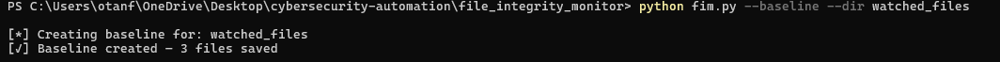
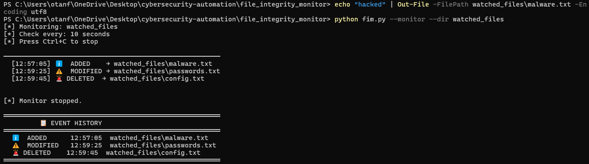

#  File Integrity Monitor (FIM)

A Python tool that monitors sensitive files and directories for unauthorized changes using SHA-256 hashing.




##  Features
- Creates a cryptographic baseline snapshot of files
- Detects MODIFIED, DELETED, and ADDED files in real-time
- Logs all events to a SQLite database
- Displays full event history

##  Requirements
```bash
pip install watchdog
```

##  Usage
```bash
# Step 1 — Create baseline snapshot
python fim.py --baseline --dir watched_files

# Step 2 — Start monitoring
python fim.py --monitor --dir watched_files

# Step 3 — View event history
python fim.py --history
```

##  Sample Output
```
[*] Monitoring: watched_files
[*] Check every: 10 seconds

  [12:57:05] ℹ️  ADDED    → watched_files\malware.txt
  [12:58:10] ⚠️  MODIFIED → watched_files\passwords.txt
  [12:59:30] 🚨 DELETED  → watched_files\config.txt
```

##  Skills Demonstrated
- SHA-256 file hashing
- SQLite database management
- Real-time file monitoring
- Baseline comparison logic
