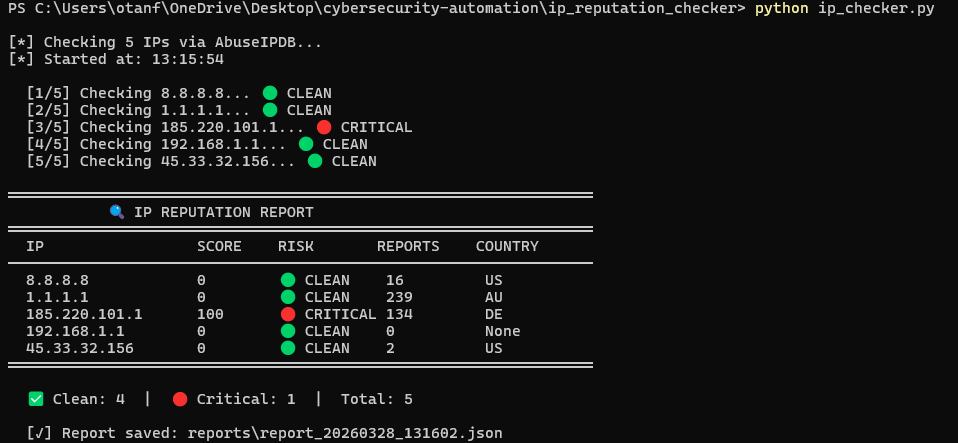

#  IP Reputation Checker

A Python tool that checks IP addresses against AbuseIPDB to identify malicious actors and generate reputation reports.



##  Features
- Checks multiple IPs in bulk from a text file
- Integrates with AbuseIPDB API
- Color-coded risk levels (CLEAN / LOW / MEDIUM / HIGH / CRITICAL)
- Saves detailed JSON reports automatically

##  Requirements
```bash
pip install requests
```

##  Setup
1. Get a free API key from [abuseipdb.com](https://www.abuseipdb.com)
2. Add your key in `ip_checker.py`:
```python
ABUSEIPDB_KEY = "your_api_key_here"
```

##  Usage
```bash
# Add IPs to ips.txt then run
python ip_checker.py

# Custom IP file
python ip_checker.py --file my_ips.txt
```

##  Sample Output
```
  IP                 SCORE    RISK       REPORTS    COUNTRY
  8.8.8.8            0        🟢 CLEAN    16         US
  185.220.101.1      100      🔴 CRITICAL 134        DE
  45.33.32.156       0        🟢 CLEAN    2          US

  ✅ Clean: 4  |  🔴 Critical: 1  |  Total: 5
```

## 🧠 Skills Demonstrated
- REST API integration
- Bulk data processing
- Risk scoring & classification
- Automated JSON report generation
