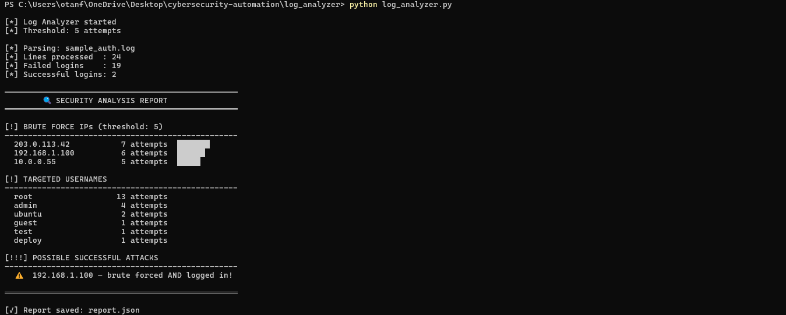

#  Log Analyzer & Brute Force Detector

A Python tool that parses SSH authentication logs to detect brute force attacks and compromised accounts.



##  Features
- Detects brute force attacks based on failed login threshold
- Identifies most targeted usernames (root, admin...)
- Flags IPs that brute forced AND successfully logged in
- Generates structured JSON report

##  Requirements
No external libraries needed — Python 3.8+ only

##  Usage
```bash
# Basic usage
python log_analyzer.py

# Real auth log
python log_analyzer.py --log /var/log/auth.log

# Custom threshold
python log_analyzer.py --threshold 10
```

##  Sample Output
```
[!] BRUTE FORCE IPs (threshold: 5)
  203.0.113.42      7 attempts  ███████
  192.168.1.100     6 attempts  ██████

[!!!] POSSIBLE SUCCESSFUL ATTACKS
    192.168.1.100 — brute forced AND logged in!
```

##  Skills Demonstrated
- Log parsing with Regex
- Pattern detection & cross-referencing
- CLI design with argparse
- JSON report generation
